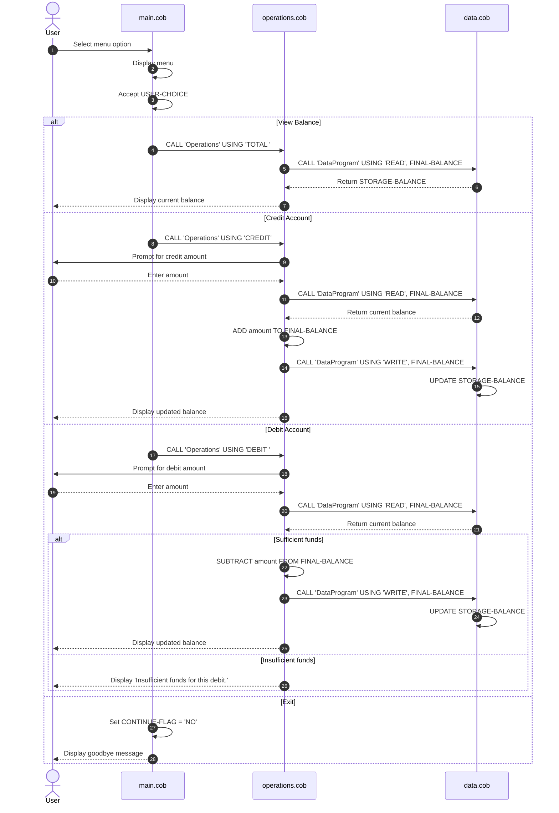

# COBOL Student Account System

This project contains a small COBOL-based account management application. It models a basic student account ledger with a balance, credit transactions, and debit transactions. The design is intentionally simple and demonstrates how legacy procedural COBOL code can be organized into separate modules for UI, business logic, and data persistence.

## File overview

### main.cob
Purpose:
- Entry point for the application.
- Displays the account menu and routes the user to the correct operation.

Key behavior:
- Shows the following options:
  1. View Balance
  2. Credit Account
  3. Debit Account
  4. Exit
- Accepts a numeric menu choice from the user.
- Calls the `Operations` program with a command string based on the selected action.
- Repeats until the user chooses to exit.

Important logic:
- `MAIN-LOGIC` is the main program loop.
- `USER-CHOICE` is validated with `EVALUATE`.
- If the user enters an invalid option, the program shows: `Invalid choice, please select 1-4.`

### operations.cob
Purpose:
- Contains the core account operations.
- Implements balance inquiry, credit, and debit processing.

Key functions and logic:
- `PROCEDURE DIVISION USING PASSED-OPERATION`
- Accepts an operation code such as:
  - `TOTAL ` (view balance)
  - `CREDIT` (add funds)
  - `DEBIT ` (remove funds)
- Reads the current balance through `CALL 'DataProgram' USING 'READ', FINAL-BALANCE`
- Updates the stored balance through `CALL 'DataProgram' USING 'WRITE', FINAL-BALANCE`

Transactions:
- View balance:
  - Reads balance from storage and displays it.
- Credit amount:
  - Prompts for an amount.
  - Reads current balance.
  - Adds the amount.
  - Writes the updated balance back.
- Debit amount:
  - Prompts for an amount.
  - Reads current balance.
  - Checks whether funds are sufficient before subtracting.

### data.cob
Purpose:
- Provides the balance storage layer.
- Acts as a minimal repository for reading and writing the current account balance.

Key functions and logic:
- `PROCEDURE DIVISION USING PASSED-OPERATION BALANCE`
- Supports two operation types:
  - `READ`: returns the stored balance to the caller
  - `WRITE`: stores the incoming balance back into working storage
- Uses `STORAGE-BALANCE` as the internal account total.

## Business rules for the student account

The code enforces a small set of practical account rules:

- Initial balance: `1000.00`
- The account must always have a valid numeric balance in the format `9(6)V99`.
- Credits increase the balance by the amount entered.
- Debits reduce the balance only if there are enough funds.
- Overdrafts are not allowed.
- If a debit exceeds the current balance, the program displays: `Insufficient funds for this debit.`
- The account cannot go negative under the current logic.

## Data flow summary

1. The user selects an action in `main.cob`.
2. `main.cob` calls `Operations` with the requested action.
3. `Operations` reads the current balance from `DataProgram`.
4. `Operations` performs the requested financial action.
5. `Operations` writes the updated balance back to `DataProgram`.

## Notes

This is a simplified educational example, not a full banking system. It does not include:
- multiple accounts or account IDs
- student-specific validation rules such as enrollment status
- audit trails or transaction history
- interest calculation or fees
- user authentication or role-based access

The application is best understood as a demonstration of COBOL modular programming and basic account validation logic.

## Sequence diagram

